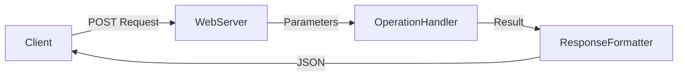
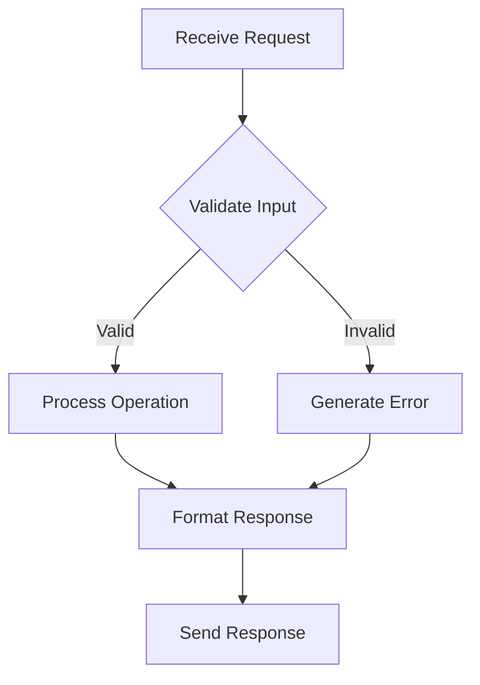

# Data Flow Diagram Description

## 1. User Interaction Flow

## 2. Operation Processing Flow

## 3. Component Interaction

### Client → Web Server
- Sends POST request to specific operation endpoint
- Includes operands as request parameters

### Web Server → Operation Handler
- Validates request format
- Extracts operation parameters
- Routes to appropriate operation handler

### Operation Handler → Response Formatter
- Performs mathematical calculation
- Handles special cases (e.g., division by zero)
- Passes result for formatting

### Response Formatter → Client
- Formats result according to operation type
- Creates JSON response
- Returns to client

## 4. Data Types and Transformations

### Input Data
- All numeric inputs accepted as numbers
- Parameters passed via POST request body

### Internal Processing
- Numbers handled as floating-point for precision
- Special case handling for division by zero

### Output Data
- All responses in JSON format
- Operation-specific result names (sum, difference, quotient, product)
- Error messages when applicable
